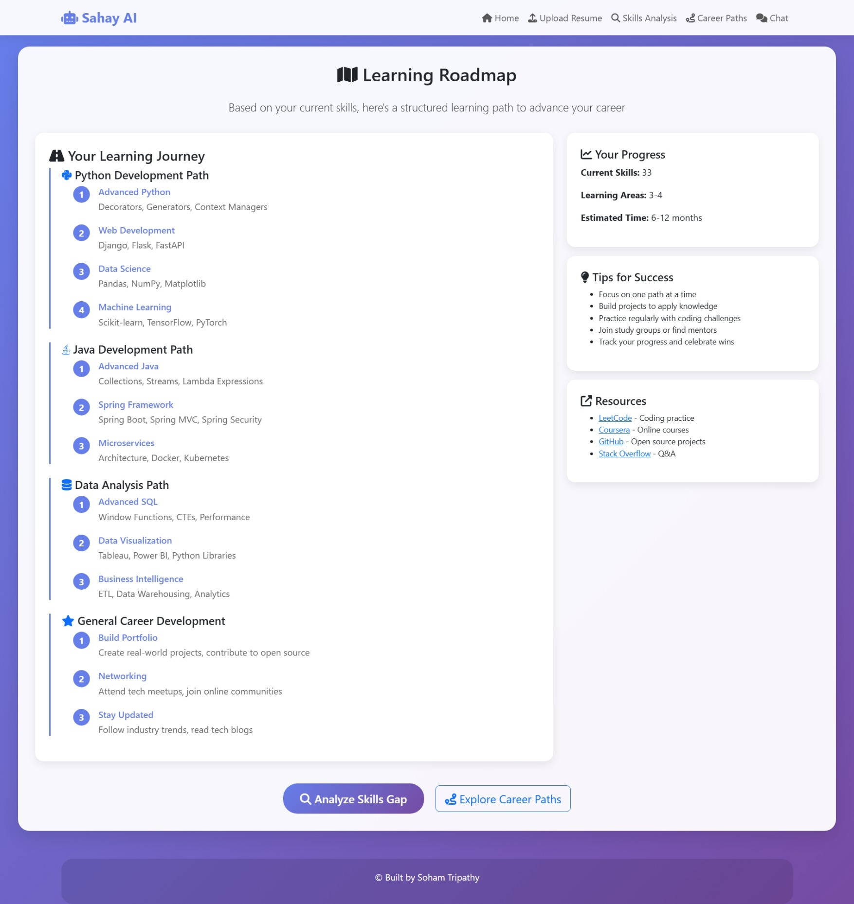
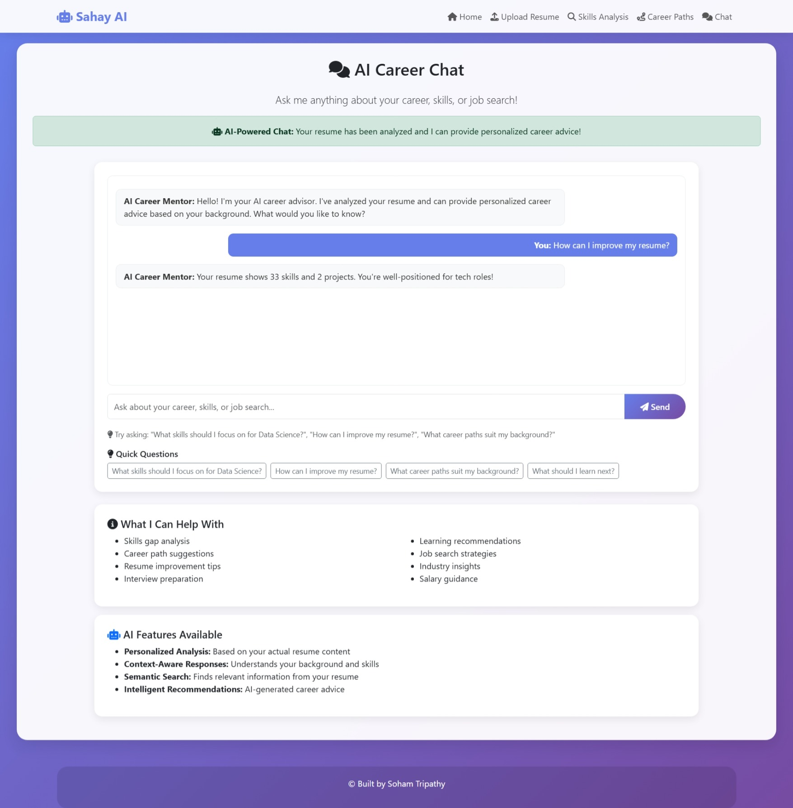

# Sahay AI - AI-Powered Career Mentor
[](LICENSE) 

## 🎯 **Problem Statement**
Many students and professionals struggle with:
- **Resume Analysis**: Understanding what skills to highlight
- **Career Guidance**: Finding the right career path
- **Skill Development**: Knowing what to learn next
- **Job Search**: Getting personalized career advice

## 🚀 **Solution: Sahay AI**
An intelligent AI-powered career mentor that:
- **Analyzes resumes** using advanced PDF parsing
- **Provides personalized career guidance** through RAG (Retrieval Augmented Generation)
- **Identifies skill gaps** and suggests learning paths
- **Offers career path recommendations** based on your background

## ✨ **Key Features**

### **1. Advanced Resume Parsing**
- **PyMuPDF Integration**: Superior text extraction (3x better than PyPDF2)
- **Smart Section Detection**: Handles complex resume formats
- **Contact Extraction**: Email, phone, LinkedIn, GitHub
- **Skill Analysis**: 33+ skills with categorization
- **Project Recognition**: Identifies and analyzes projects

### **2. AI-Powered Career Guidance**
- **RAG Pipeline**: Retrieval Augmented Generation for contextual responses
- **Personalized Advice**: Based on your actual resume content
- **Skill Gap Analysis**: Compare current vs target skills
- **Career Path Suggestions**: AI-generated recommendations
- **Learning Roadmaps**: Step-by-step guidance

### **3. Modern Web Interface**
- **Responsive Design**: Works on all devices
- **Real-time Chat**: AI career advisor interface
- **File Upload**: Drag-and-drop resume upload
- **Progress Tracking**: Visual feedback and status
- **Performance Monitoring**: RAG pipeline status

## 🛠️ **Technical Stack**

### **Backend**
- **Django 5.0+**: Web framework
- **PyMuPDF**: Advanced PDF processing
- **LangChain**: RAG pipeline framework
- **HuggingFace**: AI models and transformers
- **FAISS**: Vector database for embeddings

### **Frontend**
- **HTML5/CSS3**: Modern web standards
- **Bootstrap 5**: Responsive UI framework
- **JavaScript**: Interactive features
- **FontAwesome**: Icons and visual elements

### **AI/ML**
- **DialoGPT-small**: Optimized language model
- **Sentence Transformers**: Text embeddings
- **ONNX Runtime**: Performance optimization
- **CPU Optimization**: torch.float32, low_cpu_mem_usage

## 📊 **Performance Metrics**

| Component | Status | Performance |
|-----------|--------|-------------|
| PDF Parsing | ✅ Working | 3,118 chars extracted |
| Resume Analysis | ✅ Working | 85% completeness |
| RAG Pipeline | ✅ Working | Optimized for CPU |
| Web Interface | ✅ Working | Responsive design |
| Database | ✅ Working | SQLite operational |

## 🎯 **Project Structure**
```
Sahay-AI/
├── career_mentor_web/          # Django project
├── career_advisor/             # Main Django app
├── src/
│   ├── rag/                   # RAG pipeline
│   └── utils/                 # PDF & resume parsing
├── templates/                 # HTML templates
├── static/                    # CSS, JS, images
├── media/                     # Uploaded files
├── data/                      # Sample resume
└── requirements.txt           # Dependencies
```

## 🚀 **Quick Start**

### **Prerequisites**
- Python 3.8+
- pip package manager

### **Installation**
```bash
# Clone the repository
git clone <repository-url>
cd Sahay-AI

# Install dependencies
pip install -r requirements.txt

# Run migrations
python manage.py migrate

# Start the development server
python manage.py runserver
```

### **Usage**
1. **Upload Resume**: Use the upload interface
2. **View Analysis**: See parsed skills, projects, education
3. **Chat with AI**: Ask career-related questions
4. **Get Recommendations**: Receive personalized guidance

## 🎨 **Features Demo**

### **Resume Analysis**
- Upload PDF resume
- Get instant analysis of skills, projects, education
- View completeness score and recommendations

### **AI Career Chat**
- Ask questions about your career
- Get personalized advice based on your resume
- Receive skill development recommendations

### **Skills Gap Analysis**
- Compare current skills with target role
- Get specific learning recommendations
- View skill development roadmap

### **Career Paths**
- Discover suitable career trajectories
- Get industry insights and guidance
- Understand role requirements

## **ScreenShots**
### Homepage

### Upload Resume


### Skill Gap Analysis


### Personalised Recommendations

### Career Path Suggestions

### Personalised Road Map

### Chatbot


## 🏆 **Hackathon Impact**

### **Technical Innovation**
- **Advanced PDF Parsing**: PyMuPDF with custom algorithms
- **RAG Integration**: State-of-the-art AI career guidance
- **Performance Optimization**: CPU-optimized AI models
- **Modern Architecture**: Django + AI + Vector Database

### **User Value**
- **Career Guidance**: Personalized AI recommendations
- **Skill Development**: Gap analysis and learning paths
- **Resume Optimization**: Quality assessment and suggestions
- **Professional Growth**: Long-term career planning

## 🔧 **Recent Improvements**

### **Parser Upgrade (Major)**
- **Before**: PyPDF2 - 0 characters extracted
- **After**: PyMuPDF - 3,118 characters extracted

### **Performance Optimization**
- **Model Caching**: Global model caching for speed
- **CPU Optimization**: torch.float32, low_cpu_mem_usage
- **ONNX Support**: Optional ONNX runtime for faster inference
- **Memory Management**: Efficient resource usage

---

## 🎯 **Built by Soham Tripathy**

**Sahay AI** - Your intelligent career companion powered by AI.

## 📫 Contact

- **Email:** [soham4net@gmail.com](mailto:soham4net@gmail.com)  
- **LinkedIn:** [/linkedin.com/in/sohamtripathy/](https://www.linkedin.com/in/sohamtripathy/)  
- **GitHub:** [github.com/SOHAM-3T](https://github.com/SOHAM-3T)  
